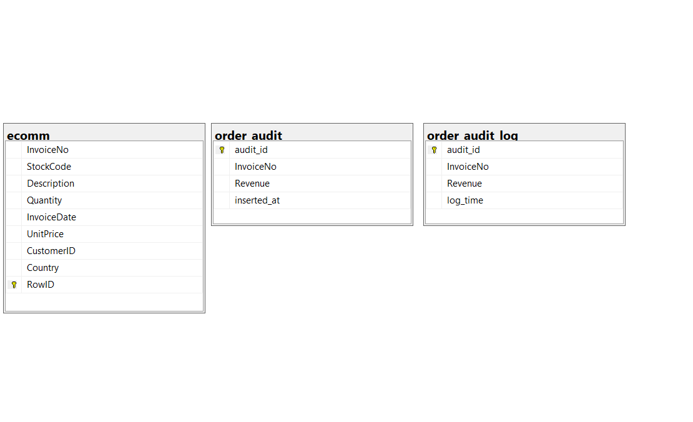
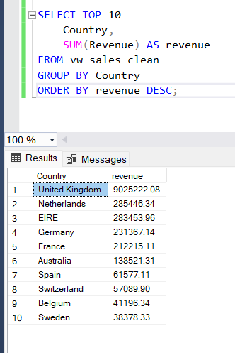
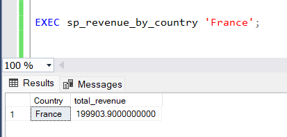
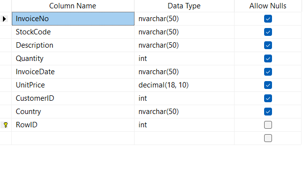

# E-Commerce-SQL-Project
Complete SQL Server E-Commerce Data Analysis Project with KPIs, Triggers, Stored Procedures, Transactions and Error Handling.

# Project Overview

This project demonstrates advanced SQL Server skills using an E-commerce dataset.

# Database Features Implemented

Data Cleaning

Primary Key & Constraints

Check Constraints

KPI Calculations

Revenue Analysis

Stored Procedures

Triggers

Transactions

TRY/CATCH Error Handling

Dynamic SQL

# Key KPIs

Total Revenue

Average Order Value

Revenue Per Month (RPM)

Top Customers

Top Countries

# Technologies Used

SQL Server

T-SQL

GitHub

## Project Screenshots

### ER Diagram
This diagram represents the structure of the E-Commerce database including primary key and relationships.

### KPI - Total Revenue

### Stored Procedure Execution

### Table Structure

# Author
Prashannavel Ganesan
